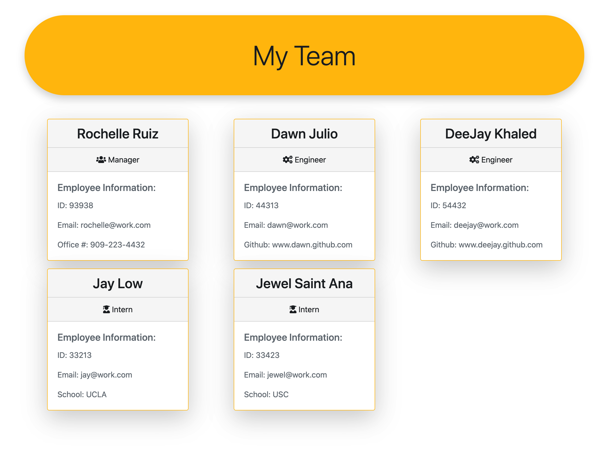

# Team Profile Generator

A Node.js command-line application that takes in information about employees on a software engineering team and generates an HTML webpage that displays summaries for each person. 

github: https://github.com/rcelevante

# Table of Contents  
[User Story](#UserStory)  

[Installation](#Installation) 

[Preview and How it works](#Preview-and-How-it-works) 

[Languages](#Languages) 

[Acknowledgement](#Acknowledgement) 

# User Story

AS A manager

I WANT to generate a webpage that displays my team's basic info

SO THAT I have quick access to their emails and GitHub profiles
# 
GIVEN a command-line application that accepts user input

WHEN I am prompted for my team members and their information

THEN an HTML file is generated that displays a nicely formatted team roster based on user input

WHEN I click on an email address in the HTML

THEN my default email program opens and populates the TO field of the email with the address

WHEN I click on the GitHub username

THEN that GitHub profile opens in a new tab

WHEN I start the application

THEN I am prompted to enter the team manager’s name, employee ID, email address, and office number

WHEN I enter the team manager’s name, employee ID, email address, and office number

THEN I am presented with a menu with the option to add an engineer or an intern or to finish building my team

WHEN I select the engineer option

THEN I am prompted to enter the engineer’s name, ID, email, and GitHub username, and I am taken back to the menu

WHEN I select the intern option

THEN I am prompted to enter the intern’s name, ID, email, and school, and I am taken back to the menu

WHEN I decide to finish building my team

THEN I exit the application, and the HTML is generated

# Installation

Steps to install application:
1. Clone the repository
2. In the directory with server.js, run `npm install`
3. In your command line, start server `node index.js`
4. Answer prompts
5. HTML will then generate
6. Preview index.html

# Preview and How it works

# Languages

* [HTML](https://developer.mozilla.org/en-US/docs/Web/HTML)
* [CSS](https://developer.mozilla.org/en-US/docs/Web/CSS)
* [Bootstrap](https://getbootstrap.com/)
* [Javascript](https://www.javascript.com/)
* [Node.js](https://nodejs.org/en/)

# Acknowledgement 

* Trilogy instructors and TA's for teaching me how to do this

